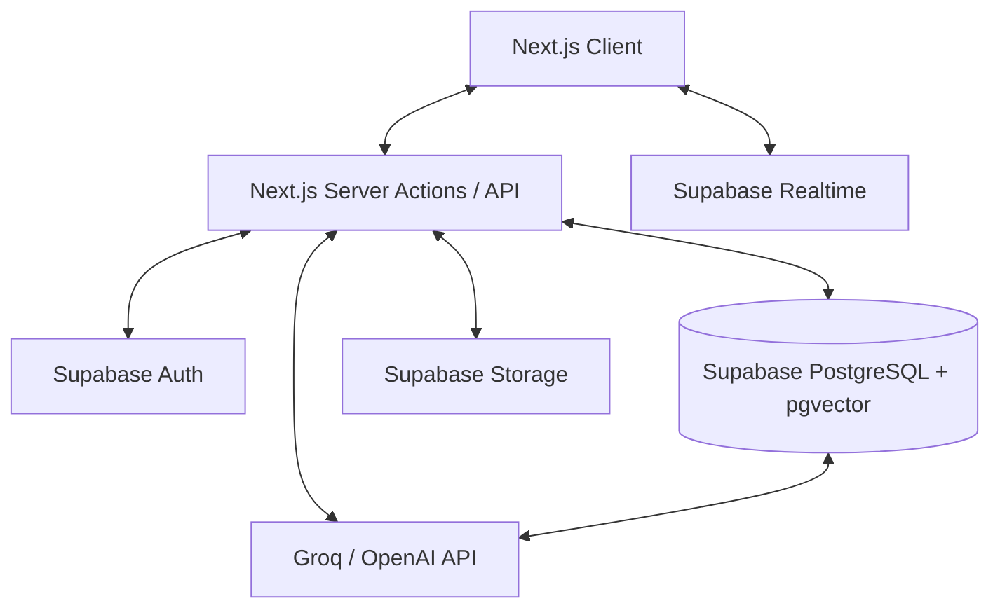

# ConnectIQ - AI-Powered Business Community Platform

ConnectIQ is an ultra-high-performance business community platform that solves the problem of **Institutional Amnesia** and **Community Data Fragmentation**. It combines **Subdomain-based Multi-Tenancy**, **Real-Time Collaboration**, and a **Hybrid RAG AI engine** powered by Groq to turn community chat logs and documents into a living, searchable knowledge base.

## 🚀 The Problem We Solved

In the era of rapid digital communication, organizations are drowning in data but starving for information. Traditional platforms like Slack, Discord, or generic chat apps suffer from two critical flaws that hinder long-term growth and productivity:

### 1. Institutional Amnesia (The "Scrolling Death")
Valuable decisions, complex technical solutions, and strategic insights are often shared in the flow of daily chat. However, as soon as the conversation scrolls off-screen, that knowledge is effectively lost. New team members spend hundreds of hours asking the same questions, and veteran contributors waste time repeating themselves. The "community memory" is fragmented and inaccessible.

### 2. Community Data Fragmentation & Security Risks
Managing multiple projects or organizations usually results in a chaotic mix of data. Without true isolation, sensitive information can easily leak between different workgroups. Furthermore, as data grows, the ability to search across multiple communities while maintaining strict privacy becomes a technical nightmare.

---

### How ConnectIQ Solves This:

- **🧠 Sangam AI (Hybrid RAG Engine)**: We don't just store messages; we understand them. Every interaction and document is embedded into a high-dimensional vector space. Using our **Hybrid Retrieval-Augmented Generation**, users can query their community brain using natural language. It’s like having an expert who has read every message ever sent and every file ever uploaded, ready to summarize or recall information in milliseconds.
  
- **🏰 Vaulted Isolation (Multi-Tenancy)**: We implemented a strict **Subdomain-level isolation** model. Using PostgreSQL Row-Level Security (RLS) and dynamic routing, we ensure that every community exists in its own "digital vault." Organization A's AI memory is physically and logically separated from Organization B's, providing bank-grade privacy with a single, unified platform experience.

- **🏆 Popularity-Based Gamification**: Most platforms reward "noise" (how many messages you send). ConnectIQ rewards **Impact**. Our leaderboard ranks users based on **Reactions Received** from others. This incentivizes high-quality, helpful contributions and naturally filters out community spam, ensuring that the most valuable members are the most visible.

---

## 🏗️ Architecture Overview

ConnectIQ is built on a **Modern Cloud-Native Stack** designed for scalability, real-time collaboration, and AI-driven insights.



## 🛠️ Tech Stack & Implementation
| Category | Technology | Usage & Rationale |
| :--- | :--- | :--- |
| **LLM Provider** | **Groq API** | High-speed inference using **llama-3.3-70b-versatile** for RAG and document intelligence. |
| **Vector Storage**| **Supabase (pgvector)**| Storage for 1536D OpenAI embeddings enabling semantic community search. |
| **Embeddings** | **OpenAI API** | Standardized `text-embedding-3-small` for reliable semantic representation. |
| **Framework** | **Next.js 15.5.9** | App Router, Server Actions, and Dynamic Subdomain routing. |
| **Real-time** | **Supabase Realtime** | WebSocket-based instant chat and reaction broadcasting. |
| **Database** | **Supabase (PostgreSQL)** | Relational data with strict Row-Level Security (RLS) for tenant isolation. |
| **Auth** | **Supabase SSR** | Secure, multi-tenant aware auth with JWT and session management. |
| **Styling** | **Tailwind CSS 4** | Utility-first CSS for a premium, responsive design system. |
| **Components** | **shadcn/ui (Radix UI)** | Accessible, unstyled primitives for complex UI elements like Modals, Selects, and Tabs. |
| **Animations** | **Framer Motion** | Smooth micro-interactions and page transitions. |
| **Forms** | **React Hook Form + Zod** | Type-safe form management and schema-based validation. |
| **Tables** | **TanStack Table** | Headless table logic for complex data displays in the admin panel. |
| **AI Vision/OCR** | **Tesseract.js / Groq** | OCR capabilities for extracting text from community-shared images. |
| **File Handling** | **Mammoth / XLSX / PDF-Parse**| Server-side extraction of text from Word, Excel, and PDF documents. |
| **Charts** | **Recharts** | Interactive data visualizations for the leaderboard and admin analytics. |
| **Icons** | **Lucide React** | Consistent, high-quality stroke icons across the platform. |

## 📁 Project Structure

```text
├── app/
│   ├── (global)/              # Public & Admin routes (Auth, Admin Dashboard, Global Lobby)
│   │   ├── (auth)/            # Authentication pages (Login, Signup, Reset Password)
│   │   ├── admin/             # Platform-wide administration tools
│   │   ├── apply-community/   # Community creation application workflow
│   │   ├── lobby/             # Main entry point for choosing communities
│   │   └── user/              # Global user settings and profile info
│   ├── [tenant]/              # Isolated Community Workspace routes
│   │   ├── announcements/     # Community-specific news and updates
│   │   ├── chat/              # Real-time workspace collaboration
│   │   ├── community/         # Workspace dashboard and overview
│   │   ├── leaderboard/       # Engagement rankings and gamification
│   │   └── profile/           # Context-aware user profiles
│   ├── actions/               # Server Actions (Mutations for Auth, Profile, etc.)
│   └── api/                   # Backend API routes (Sangam AI, Real-time Webhooks)
├── components/
│   ├── admin/                 # Admin-specific UI components
│   │   ├── templates/         # Document template management UI
│   │   └── users/             # User management tables
│   ├── community/             # Real-time chat & Sangam AI interface
│   ├── leaderboard/           # Ranking cards and filters
│   ├── layout/                # Global and Tenant-specific navigation
│   └── ui/                    # Base Design System (shadcn/ui)
├── constants/                 # Static content and configuration tokens
├── contexts/                  # React Contexts (Tenant state, Global Auth)
├── docs/                      # Detailed Technical Documentation
├── hooks/                     # Custom React Hooks for UI and Logic
├── lib/
│   ├── sangam/                # AI Core (Embeddings, RAG logic, Gemini integration)
│   ├── services/              # Business logic (Chat Service, Leaderboard Engine)
│   ├── types/                 # TypeScript interfaces and global schemas
│   ├── functions/             # Utility functions for Tenant and User management
│   └── utils/                 # General helper utilities
├── public/                    # Static assets (Images, SVG icons)
├── scripts/                   # Database migration and setup SQL scripts
├── middleware.ts              # Multi-tenant resolution & security middleware
└── tailwind.config.ts         # Global styling and design tokens
```

## 🏗️ Architecture
The platform is built on a **Modular Service Architecture**.
- **The Core**: Next.js App Router for high-performance server-side rendering.
- **The Engine**: Supabase for real-time data flow and secure multi-tenancy via RLS.
- **The Brain**: Sangam AI (Hybrid RAG) for semantic search and intelligent automation.

For a detailed breakdown, see [Architecture Docs](docs/architecture.md).

## 🌟 Key Features
- **Isolated Community Hubs**: Multi-tenant infrastructure with slug-based routing.
- **Real-time Engine**: Live chat, instant reactions, and optimistic UI updates.
- **Sangam AI Assistant**: Hybrid RAG system that understands your community context.
- **Popularity Leaderboard**: Gamification system that ranks users by engagement.
- **Admin Dashboard**: Full control over users, templates, and announcements.

See the [Features Guide](docs/features.md) for implementation details.

## 🛠️ Local Setup & Multi-Tenancy
ConnectIQ supports **Subdomain-based Multi-Tenancy** on localhost for a production-like experience.

### 1. Clone & Install
```bash
git clone <repo-url>
pnpm install
```

### 2. Environment Configuration
Copy `.env.example` to `.env.local` and fill in your Supabase, OpenAI, and Gemini keys.

### 3. Database Setup
Execute the SQL scripts located in the [Database Docs](docs/database.md) in your Supabase SQL Editor.

### 4. Testing Subdomains on Localhost
To test the full subdomain experience (e.g., `genius.localhost:3000`):
1. **Edit Hosts File**: Open your hosts file (Windows: `C:\Windows\System32\drivers\etc\hosts`) as Administrator.
2. **Add Mappings**: Add the following lines:
   ```text
   127.0.0.1 genius.localhost
   127.0.0.1 alpha.localhost
   ```
3. **Run Platform**: `pnpm dev`.
4. **Access Community**: Open your browser to `http://genius.localhost:3000`.
5. **Notice the Isolation**: Every subdomain represents a completely isolated community context.

> [!NOTE]
> **Vercel Deployment Note**
> In a production Vercel environment, you must configure **Wildcard Domains** (`*.yourdomain.com`) in your project settings and ensure your DNS provider supports wildcard CNAME records. For the demo, path-based fallback (`domain.com/genius`) is also supported.

---
Built with ❤️ by team Businessmen.