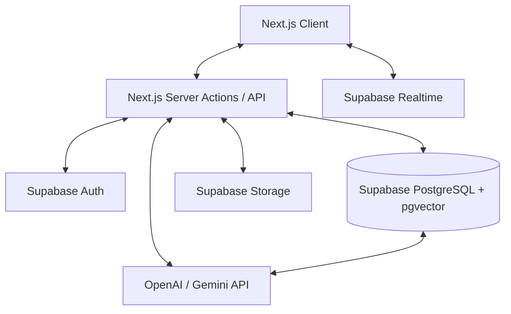

# Architecture Overview

ConnectIQ is built on a **Modern Cloud-Native Stack** designed for scalability, real-time collaboration, and AI-driven insights.

## System Architecture Diagram

## Key Architectural Pillars

### 1. Multi-Tenant Isolation (The "Vault" Pattern)
Every database table in ConnectIQ includes a `tenant_id` column. We enforce strict isolation using **PostgreSQL Row-Level Security (RLS)**.
- **Why it was needed**: To allow multiple independent organizations to use the same platform without data leaks.
- **Problem Solved**: Eliminated the need for separate database instances per client, reducing costs and maintenance while maintaining high security.

### 2. Hybrid RAG (Intelligent Memory)
We combine traditional database queries with vector-based semantic search.
- **Implementation**: When a message is sent, it is embedded into a 1536-dimensional vector and stored.
- **Problem Solved**: Solves the "needle in a haystack" problem where users couldn't find past decisions or files in a fast-moving chat.

### 3. Serverless Edge Logic
Using Next.js Server Actions and Middleware, we reduce the distance between the user and the logic.
- **Implementation**: Middleware handles tenant resolution and route guarding.
- **Problem Solved**: Reduced latency and simplified the mental model for state management.

## Technology Stack Justification

| Technology | Where it is used | Why we used it |
| :--- | :--- | :--- |
| **Next.js 15** | Entire Frontend/Backend | Best-in-class performance and dynamic subdomain routing. |
| **Groq API** | Sangam AI Engine | We use **llama-3.3-70b-versatile** for its incredible speed and reasoning capabilities in RAG workflows. |
| **Supabase** | Auth, DB, Realtime | Unified platform that handles the complexities of real-time sync and security. |
| **pgvector** | Vector Storage | Allows us to store and query 1536-dimensional OpenAI embeddings directly inside PostgreSQL. |
| **OpenAI Embeddings** | Vector Search | Industry standard for reliable semantic understanding of text. |
| **Tailwind CSS 4** | Styling | Rapid UI development with a consistent, premium design system. |
